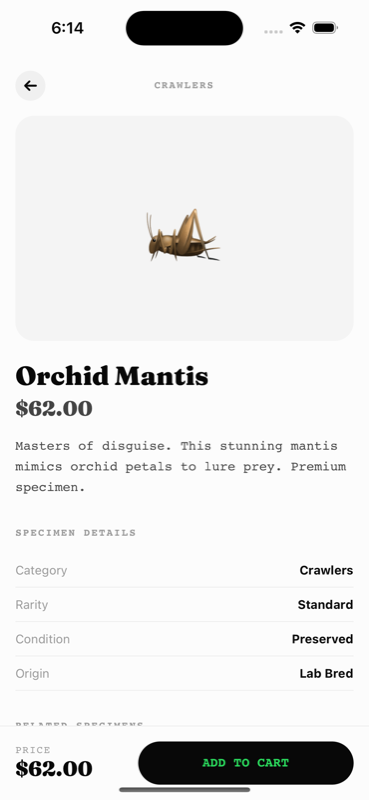
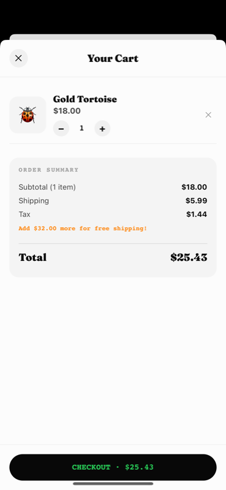

# Mobile PR Reviewer

> Part of [Mobile DevTools](https://github.com/RevylAI/mobile-devtools) — open-source tools for mobile engineering teams.

AI-powered visual PR reviews for mobile apps. Two modes:

1. **Interactive** — Claude boots a cloud device, navigates to the changed screen, and posts screenshots
2. **E2E Test** — Claude creates a YAML test from the diff, runs it on Revyl's platform, and posts a shareable report

> Developer pushes a button color change → Claude boots a phone in the cloud → taps through to the screen → screenshots the result → posts it in the PR. Automatically.

## How It Works

### Mode 1: Interactive Review (default)

```
PR opened
  → GitHub Actions builds the app
  → Uploads build to Revyl cloud
  → Claude Code Action triggers:
      1. Reads the git diff
      2. Figures out what screens changed
      3. Starts a cloud device with the new build
      4. Navigates to the changed screen using natural language
         (e.g. revyl device tap --target "Add to Cart button")
      5. Takes screenshots as evidence
      6. Posts results as a PR comment
```

Triggered automatically on PR open, or re-trigger with a `/review` comment.

### Mode 2: E2E Test Review

```
Comment "/test" on a PR
  → Claude Code Action triggers:
      1. Reads the git diff
      2. Creates a YAML E2E test definition targeting the changed flows
      3. Pushes the test to Revyl's cloud platform
      4. Runs the test against the latest uploaded build
      5. Generates a shareable report link
      6. Posts results with the report link as a PR comment
```

Triggered by commenting `/test` on a PR (requires a build from a prior PR push).

### Example PR Comments

**Interactive mode** — Screenshots from a live device session:

| Orchid Mantis product page ($62.00) | Bug: Cart shows Gold Tortoise ($18.00) |
|---|---|
|  |  |

> **Result:** Bug reproduced — Orchid Mantis to Gold Tortoise substitution confirmed.

**Test mode** — Claude creates a 5-step E2E test from the diff, runs it on an iPhone 16, and catches the cart substitution bug:

> **Status:** Failed (bug caught)  |  **Report:** [View full report](https://app.revyl.ai/tests/report?taskId=4028df46-5cce-410c-bbe2-e40a6d42657d)  |  **Test steps:** 5 blocks

The test validated the shop screen, scrolled to Orchid Mantis, confirmed the product detail page, tapped ADD TO CART, then caught the bug — the cart showed "Gold Tortoise" at $36.00 instead of "Orchid Mantis" at $62.00.

Full interactive mode example with screenshots: [`examples/sample-pr-comment.md`](examples/sample-pr-comment.md)

## Setup (5 minutes)

### 1. Fork this repo

Click **Fork** and clone it. The `sample-app/` directory contains [Bug Bazaar](sample-app/), a React Native e-commerce app you can use to test immediately.

### 2. Add 3 secrets

Go to **Settings → Secrets and variables → Actions** and add:

| Secret | Where to get it |
|--------|----------------|
| `ANTHROPIC_API_KEY` | [console.anthropic.com](https://console.anthropic.com/) |
| `REVYL_API_KEY` | [app.revyl.ai](https://app.revyl.ai) → Settings → API Keys |
| `REVYL_APP_ID` | Run `revyl app create --name "my-app" --platform android --json` |

### 3. Open a PR

Make any change to `sample-app/` and open a pull request.

- **Interactive review** runs automatically on PR open
- **E2E test review** runs when you comment `/test` on the PR

That's it. Three secrets, one workflow file, two review modes.

## Try It Now

The sample app has an **intentional bug** you can use to test:

```tsx
// sample-app/context/CartContext.tsx line 38-39
// Adding "Orchid Mantis" (id:3) silently adds "Gold Tortoise" (id:4) instead
```

Open a PR that "fixes" this bug — change `id === 3` back to the correct product.

- **Interactive:** Claude boots a device, adds Orchid Mantis to cart, and catches the substitution
- **Test:** Claude creates a test that validates cart contents after adding Orchid Mantis

## Customize for Your App

This repo is a template. To use it with your own mobile app:

### 1. Replace the sample app

Delete `sample-app/` and add your own app source (or just point the build step at your existing CI):

```yaml
# .github/workflows/review.yml — customize the build step
- name: Build app
  run: |
    # Gradle (Android)
    ./gradlew assembleDebug

    # Xcode (iOS)
    # xcodebuild -scheme MyApp -sdk iphonesimulator -configuration Debug

    # Flutter
    # flutter build apk --debug

    # React Native
    # npx react-native build-android --mode=debug
```

### 2. Update CLAUDE.md and CLAUDE-test.md

Tell Claude about your app's screens and navigation:

```markdown
## Your App

- **Login** — Email + password, then OTP verification
- **Dashboard** — Stats cards, recent activity feed
- **Settings** — Profile, notifications, theme toggle

Navigation: Bottom tabs (Dashboard, Activity, Settings). Login is shown when not authenticated.
```

The more context you give Claude about your app, the better it navigates (interactive) or designs tests (test mode).

### 3. Set your Revyl app ID

```bash
# Create your app on Revyl
revyl app create --name "MyApp" --platform android --json

# Add the returned ID as REVYL_APP_ID secret
```

### 4. (Optional) Use with existing CI

If you already have CI that builds your app, skip the build job and just download the artifact:

```yaml
review:
  # Remove the "needs: build" line
  steps:
    # Download from your existing build pipeline
    - uses: actions/download-artifact@v4
      with:
        name: my-app-build
        path: build/
    # ... rest of review job
```

## Architecture

```
.github/workflows/review.yml   # GitHub Actions: build → upload → Claude reviews
CLAUDE.md                       # Instructions for interactive mode (live device)
CLAUDE-test.md                  # Instructions for test mode (YAML test → report)
sample-app/                     # Bug Bazaar — demo React Native e-commerce app
examples/
└── sample-pr-comment.md        # What the PR comment looks like
```

The review bot is **three files**: `review.yml` (the trigger), `CLAUDE.md` (interactive instructions), and `CLAUDE-test.md` (test mode instructions). Everything else is the sample app.

## How the Revyl CLI Works

**Interactive mode** uses AI-grounded device interaction:

```bash
# Natural language targeting — no accessibility IDs, no XPaths
revyl device tap --target "Add to Cart button"
revyl device type --target "Search field" --text "beetles"
revyl device screenshot --out evidence.png
```

**Test mode** uses structured YAML tests:

```bash
# Create and run an E2E test
revyl test create my-test --from-file test.yaml --platform android --no-open
revyl test run my-test --json --verbose
revyl test share my-test  # → shareable report link
```

Both approaches use Revyl's cloud devices — no local emulators or physical devices needed.

## Built With

- [Revyl CLI](https://github.com/RevylAI/revyl-cli) — Cloud device provisioning and AI-grounded interaction
- [Claude Code Action](https://github.com/anthropics/claude-code-action) — Run Claude Code in GitHub Actions
- [Expo](https://expo.dev) — React Native framework (sample app)

## License

MIT
