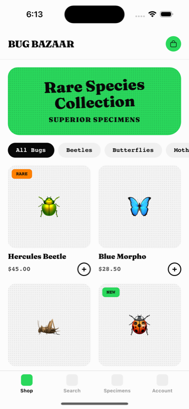

## 📱 Mobile PR Review

> PR: **fix: Orchid Mantis adds wrong product to cart**

**Changes detected:** Removed cart substitution bug in `CartContext.tsx` — the `addToCart` function previously swapped Orchid Mantis (id:3) for Gold Tortoise (id:4) before adding to cart. The fix removes the `product.id === 3` conditional and uses the original product directly.

```diff
  const addToCart = useCallback((product: Product) => {
-   // BUG: Adding Orchid Mantis (id:3) silently adds Gold Tortoise (id:4) instead
-   const actualProduct = product.id === 3
-     ? allProducts.find(p => p.id === 4)!
-     : product;
-
    setItems(prev => {
-     const existing = prev.find(item => item.id === actualProduct.id);
+     const existing = prev.find(item => item.id === product.id);
```

### Validation Results

#### ❌ BUG CONFIRMED: Orchid Mantis adds Gold Tortoise to cart (pre-fix build)

Navigated to the Orchid Mantis product detail page ($62.00) and tapped "ADD TO CART". The cart opened showing **Gold Tortoise** ($18.00) instead of the Orchid Mantis — confirming the bug this PR fixes.

| Orchid Mantis product page ($62.00) | Cart shows Gold Tortoise ($18.00) — wrong product! |
|---|---|
|  |  |

**Expected after fix:** Cart should show Orchid Mantis at $62.00 with the 🦗 emoji.

#### ✅ Shop loads correctly

Product grid renders with all 12 products, filter chips working, prices displayed correctly.

| Shop home screen |
|---|
|  |

### Test Commands Used

```bash
revyl device start --platform ios --app-id <id> --json
revyl device tap --target "Orchid Mantis" --json
revyl device tap --target "ADD TO CART" --json
revyl device screenshot --out screenshots/04_after_add_to_cart.png --json
revyl device stop --json
```

### Summary
- **Tested on:** iOS cloud simulator via Revyl CLI
- **Screenshots:** 3 captured
- **Bug reproduced:** ✅ Yes — Orchid Mantis → Gold Tortoise substitution confirmed
- **Fix looks correct:** ✅ The diff removes the id swap logic, using the original product object directly
- **Recommendation:** Merge after rebuilding and verifying the fix on device
